# Workshop 1: Custom Vision AI - Find the Right Tool!

## Session Information

**Session Title:** Creating applications that can see, hear, speak or understand - using Microsoft Cognitive Services

**Session Abstract:** In this workshop you will be introduced to the [Microsoft Azure Cognitive Services](https://azure.microsoft.com/en-gb/services/cognitive-services/?WT.mc_id=ainights-github-heboelma), a range of offerings you can use to infuse intelligence and machine learning into your applications without needing to build the code from scratch.
We will cover pre-trained AI APIs, such as [computer vision](https://azure.microsoft.com/en-gb/services/cognitive-services/directory/vision/?WT.mc_id=ainights-github-amynic), that are accessed by REST protocol. Next we will dive into Custom AI that uses transfer learning - [Microsoft Azure Custom Vision](https://azure.microsoft.com/en-gb/services/cognitive-services/custom-vision-service/?WT.mc_id=ainights-github-heboelma). This enables you to provide a small amount of your own data to train an image classification model. Wrapping the workshop up by building our custom trained AI into an application - using [Logic Apps](https://azure.microsoft.com/en-gb/services/logic-apps/?WT.mc_id=ainights-github-heboelma), this technology is ideal for building data pipeline processes that work with your machine learning models.


## Pre-requisites for your machine

* Clone this repository to your local machine to gain images and code samples you need for the demos: ```git clone https://github.com/mdragt/GoDataFest.git``` or choose 'Clone or Download' green button and then 'Download ZIP'
* Azure Pass or [Microsoft Azure Subscription](https://azure.microsoft.com/en-gb/free/?WT.mc_id=ainights-github-heboelma)
* Laptop with a modern web browser (Google Chrome, Microsoft Edge)
* Postman, API Development Environment - [available on Windows, Linux and macOS](https://www.getpostman.com/)

> *All demos and content have been tested on a Windows PC, however all options should run from macOS and Linux machines as well. Please provide information via an issue or pull request if you have feedback on other operating systems*  

## Sections

* **Task 1:** Microsoft Azure Cognitive Services - Custom Vision [Go to Section](#task-1-microsoft-azure-cognitive-services---custom-vision)
* **Task 2:** Build Custom AI into an Application - Azure Logic Apps [Go to Section](#task-2-build-custom-ai-into-an-application---azure-logic-apps)

## Task 1: Microsoft Azure Cognitive Services - Custom Vision

Using Microsoft Azure Custom Vision service you can start to build your own personalised image classification and object detection algorithms with very little code. In this exercise we will create a tool classification algorithm using tool images sourced from [WikiMedia Commons](https://github.com/mdragt/ignite-learning-paths/blob/master/aiml/aiml20/CV%20training%20images/ATTRIBUTIONS.md), used for the Ignite Tours.

We have 5 classes of tools with a various amount of images each. You can find the training files [here](CV%20training%20images/):

* Drills
* Hammers
* Hard hats
* Pliers
* Screwdrivers

There is also a set of test images (not for training) in this [folder](CV%20test%20images).

### Create Resource Group

First create a Resource Group.

* Go to the [Azure Portal](https://ms.portal.azure.com) main dashboard.
* Click 'Create a Resource' in the top left
* Search for 'Resource group'
* Enter details to create

    * A name for the resource group
    * Select the location
    * Click Create

  

### Create Custom Vision instance

Now create a Custom Vision instance in your Azure account.

* Go to your created Resource group
* Click +Add
* Search for Custom Vision
* Click Create
* Enter details to create

    * A name for the service
    * Select your subscription
    * Select the data centre location (in this example West Europe, but you can select your own region)
    * Choose the S0 tier for both 'Prediction pricing tier' and Training pricing tier
    * Select your created Resource group and make sure it is in the same data centre location (in this case 'globalaibootcamp' in West Europe
    * Click Create

### Build Classifier

Now we can build our classifier, navigate to [https://www.customvision.ai](https://www.customvision.ai/?WT.mc_id=ainights-github-heboelma) and choose sign in. Sign in with your Azure credentials account.

> Accept the terms and conditions box to continue.

#### Create Project

Once loaded choose 'New Project' which opens a window to enter details:

* Name: choose a suitable name
* Description: add a description of the classifier (example shown in image below)
* Resource Group: choose the resource group you created your custom vision service in (example: ainights[SO])
* Project Types: Classification
* Classification Types: Multiclass (Single tag per image)
* Domains: Retail (compact)
* Export Capabilities: Basic platforms


Click on 'Create Project' and you will land on an empty workspace.

#### Add Images

Now you can start adding images and assigning them tags to create our image classifier.

* In the top left, select 'Add images', browse for the first folder of images from the [training data](CV%20training%20images/) - Drills - and select all the images in the folder.

* Add the tag 'drills' to the drills images and select 'Upload files'

Once successful, you receive a confirmation message and you should see that your images are now available in the workspace.


Now complete the same steps of uploading and tagging images for the other 4 tool categories in the folder. For each type of tool:

* Click 'Add images'
* Select all the tool images
* Add the class label (hard hat, pliers, etc.)
* Choose upload
* Confirm images uploaded into the workspace

Now you should have all categories uploaded and on the left hand side you can see your tool classes and you can filter depending on type of tool image.

#### Train Model

Now you are ready to train your algorithm on the tool image data you have uploaded. Select the green **'Train'** button in the top right corner. For this demo, you can use the "Fast Training" option.

Once the training process is complete it will take you to the Performance tab. Here you will receive machine learning evaluation metrics for your model. Here you algo get information regarding the class imbalance, as some tools had less images than others.

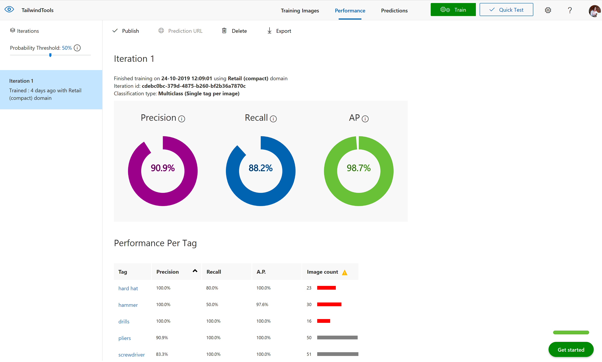

#### Test Model

Now you have a model, you need to test the model. Choose the 'Quick Test' button in the top right *(next to the train button)* this will open a window where you can browse for a local image or enter a web URL.

Browse for an image in the [test folder](CV%20test%20images) (images the model have not been trained on) and upload this image. The image will be analysed and a result returned of what tool the model thinks it is (prediction tag) and the models confidence of its result (prediction probability).


> Repeat this process for other image in the test folder, or search online for other images to see how the model performs.

#### Retrain Model

If you click on the **'Predictions'** tab on the top toolbar - you should see all the test images you have submitted. This section is for re-training, as you get new data you can add this to your model to improve its performance. The images are ordered by importance - the image, which if classified correctly, will add the most new information to the model is listed first. Whereas the last image might be very similar to other images already learnt by the model so this is less important to classify correctly.

To add these images to the model - select the first image, review the results the model provided and then in the 'My Tags' box enter the correct tag and click 'save and close'.


This image will disappear from the your predictions workspace and be added to the training images workspace. Once you add a few new images and tags you can re-train the model to see if there are improvements.

#### Publish Model

To use this model within applications you need the prediction details. Therefore, you have to go to the Performance tab from the top bar, click the **Publish** button.

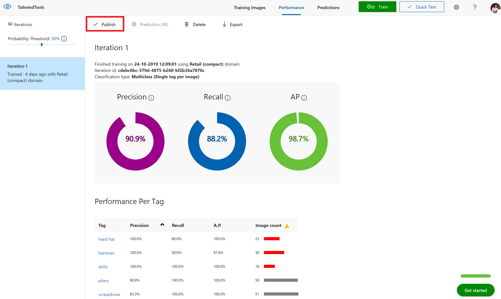

Please provide a name for your model and select the Prediction resource, and click on Publish. Please take notice of you Publication Resource, which you need in the second task.


You can now select the **Prediction URL** button to gain all information you need to create a Postman call to your API.

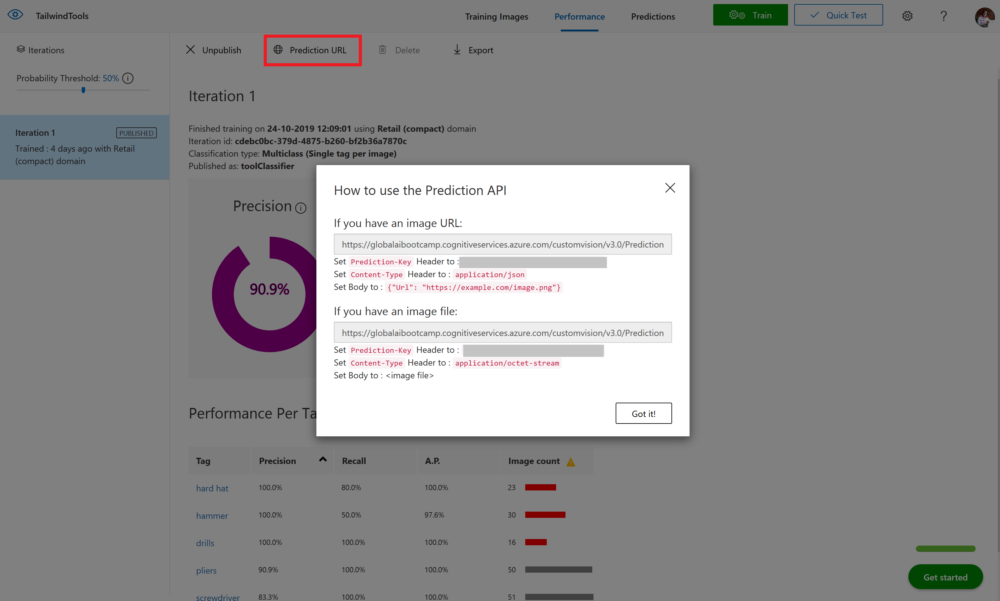

### Use Model with Postman

Open Postman and create a new collection.


Now create a new request.
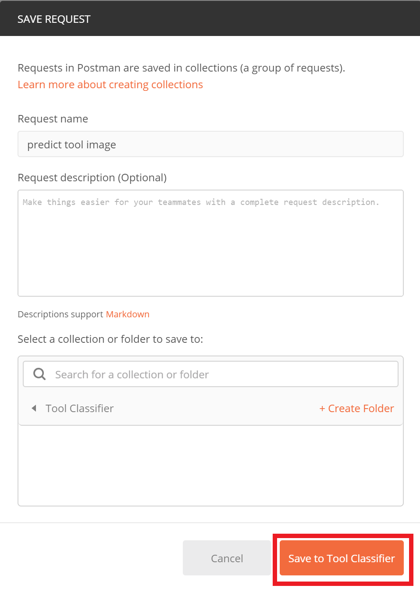

You can use the prior info to set the URL, the Header and the Body (using both an image or an image URL):

* Type of request: select POST
* URL: enter the Prediction URL
* Headers: set "Prediction-Key" and "Content-Type" items, in this case we use a URL for the image, so we set Content-Type to JSON
* Body: in this case we enter the image URL "https://upload.wikimedia.org/wikipedia/commons/d/d7/Battdrill.jpg"


Now click on Send...
What kind of tool did you upload?

**Great work!** you have created your specialised tool classification model using the Azure Custom Vision Service

## Task 2: Build Custom AI into an Application - Azure Logic Apps

In this section you will build an Azure Logic App to consume your Custom Vision AI tool classification application.

First you need to create two Azure Storage Accounts.

### Create Storage accounts

Go to the prior created Resource group on the Azure portal and click "Add" to create a new resource in the top left corner. Select the section Storage and choose the first option Storage Account.

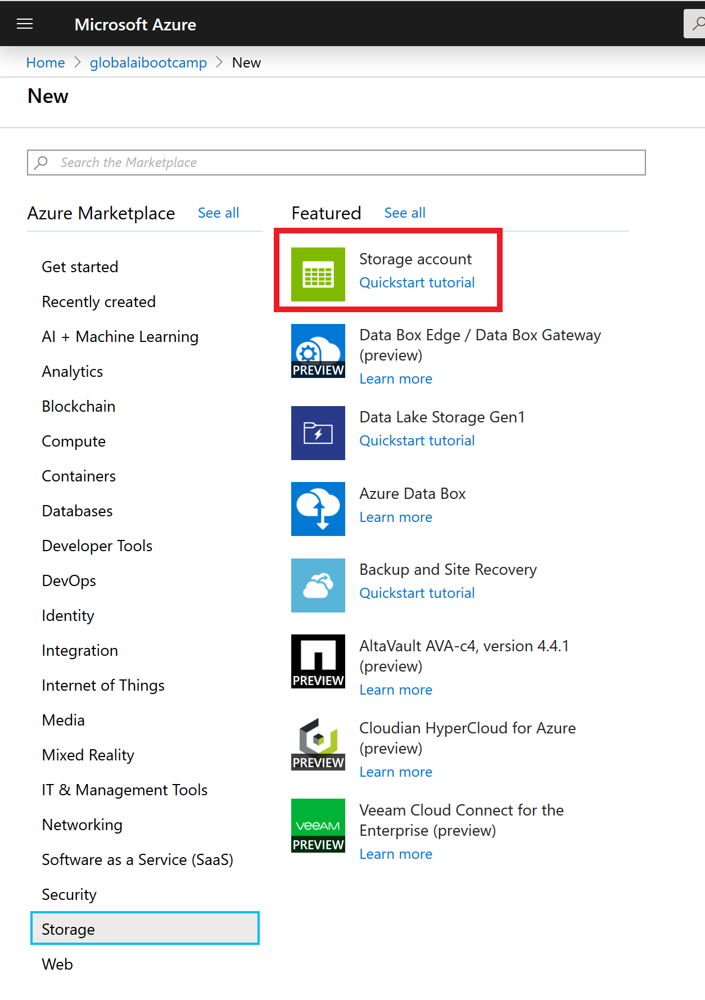

We are going to create two storage accounts:

* one for the images to be dropped into to be processed (called globalaistor)
* another for the results after processing to be uploaded to (called globalairesult)

> Complete the process below **twice** so you have two storage accounts in total

On the storage account creation page enter options to setup your storage accounts:

* **Subscription:** choose your subscription
* **Resource Group:** choose the resource group you have been using for this workshop (e.g. globalaibootcamp)
* **Storage Account Name:** (must be unique) enter an all lowercase storage account name. *Such as globalaistor(yourname) or globalairesult(yourname) - append your name to the end of the storage account name so you know its unique (remove the brackets)*
* **Location:** your closest data center (in this case West Europe)
* **Performance:** Standard
* **Account Kind:** Blob Storage
* **Replication:** Locally-redundant storage (LRS)
* **Access Tier:** Hot

Select **Review + create**, confirm validation is passed and then select **Create**

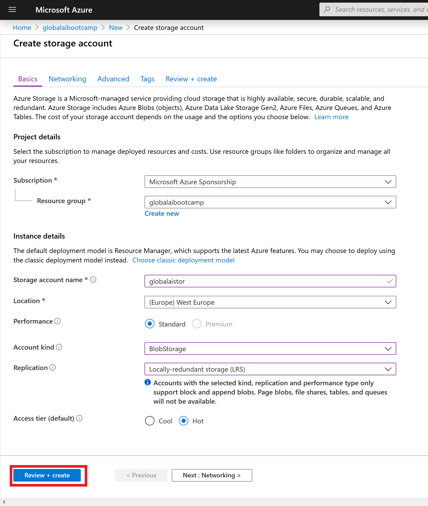

Once your deployment is complete, got to the resource and review the account settings.
Select **Containers** to review your empty blob storage account.


We need to add a container to the storage account to store our images and results.

Select the **+ Container** button and create a name for the container
> an example for the **globalaistor** account would be **images**

> an example for the **globalairesult** account would be **results**

For the public access level setting select **Container (anonymous read access for containers and blobs)**
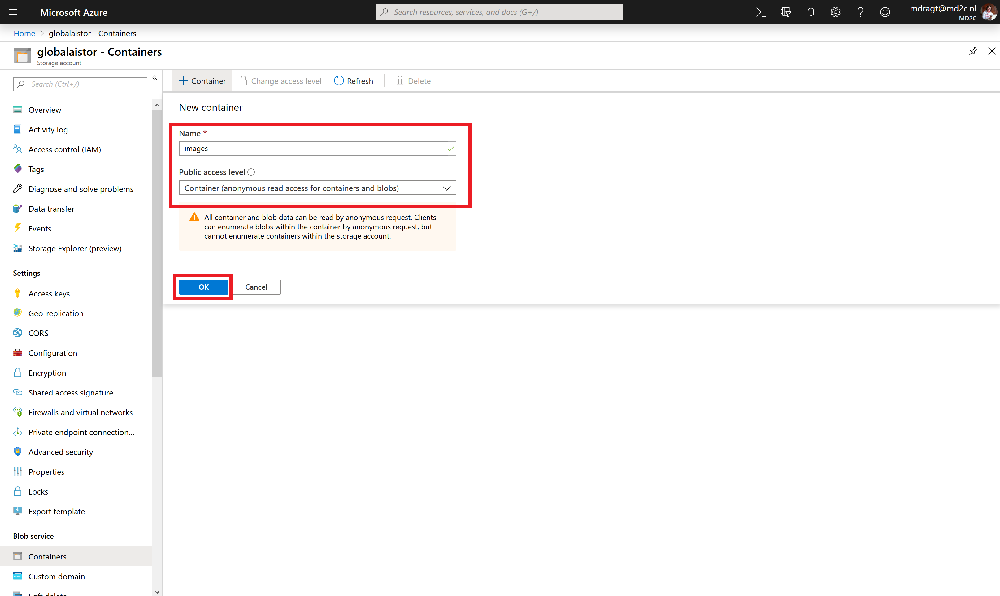

> Complete the above for an image storage account and a results storage account with the same settings

### Create Logic App

Now we will create a Logic App - this will connect your image storage account to your AI classification service and put the results in your results storage account

Head to the Azure Portal Homepage. You are going to use Event Grid, a service that detects triggers in an Azure subscription (in our case, when a new blob is created in your Azure Storage account). Before you build with this - you must register it.

Navigate to Subscriptions, select your subscription and find Resource Providers in the left pane. If it's not in left panel, select "All services" and find in here. Once the resource providers are listed - search "event" and select **Microsoft.EventGrid**.

If this is not already status registered, select **register** from the toolbar.


Once registered with a green tick - go back to your Resource Group. Select **Add**. Type Logic App and select the service.

Create the logic app by entering some setup detail like below:

* **Name:** suitable name for the tool classification application
* **Subscription:** Choose your subscription
* **Resource Group:** (use existing e.g. globalaibootcamp) select the resource group you have been working for the whole workshop
* **Location:** choose the data center closest to you
* **Log Analytics:** off

Choose **Create**

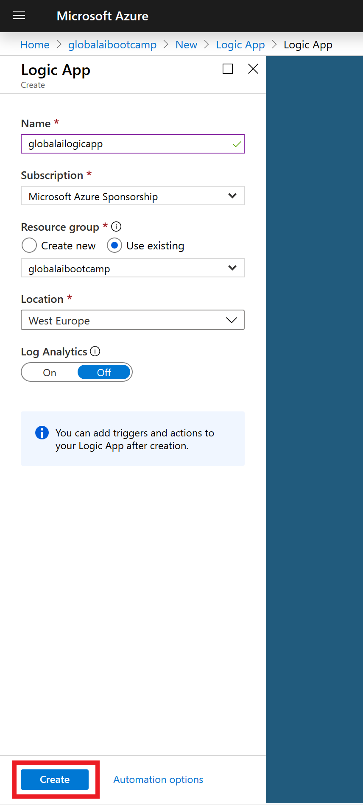

Once created, go to resource. From here we can create our logic process. Select **Logic app designer** from the left menu and then the  **When an Event Grid resource event occurs** option.

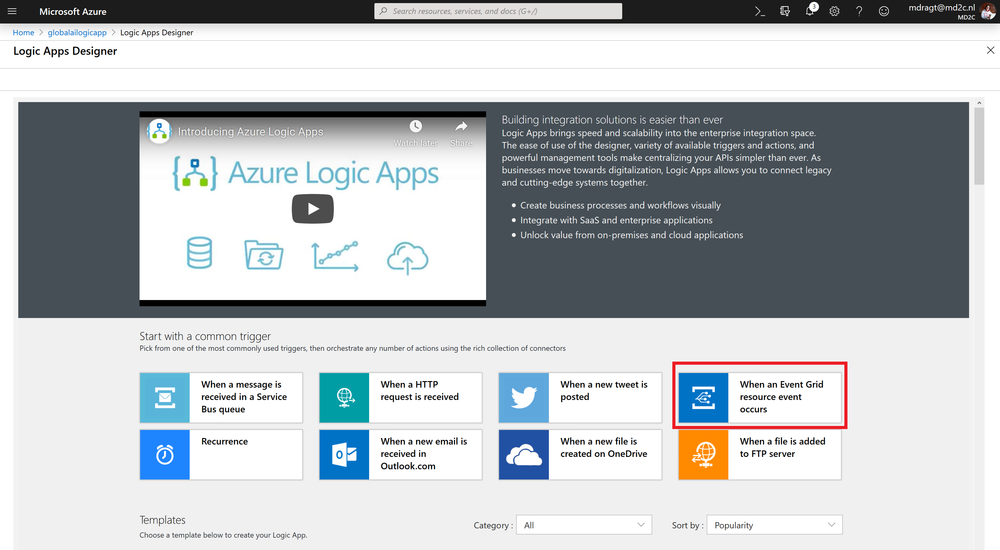

Connect to Azure event grid by signing in using your Azure credentials.


Once connected and you see a green tick, select continue.

Select the options below:

* **Subscription:** your subscription
* **Resource Type:** Microsoft.Storage.StorageAccounts
* **Resource Name:** choose your image storage account (e.g. globalaistor)
* **Event Type Item - 1:** Microsoft.Storage.BlobCreated


Then choose +New step. Type **Parse JSON** and select the parse JSON operator as part of the data Data Operations category.

* **Content:** select the box and from the Dynamic Content box on the right, select **Body**
* **Schema:** select this box and enter the JSON schema provided in the [logic-app-schema file](logic-app-schema.json), created by [Amy Boyd](https://github.com/amynic/).


Then choose next step. Type **Custom Vision** and select the **Classify an image URL (preview)** as below.

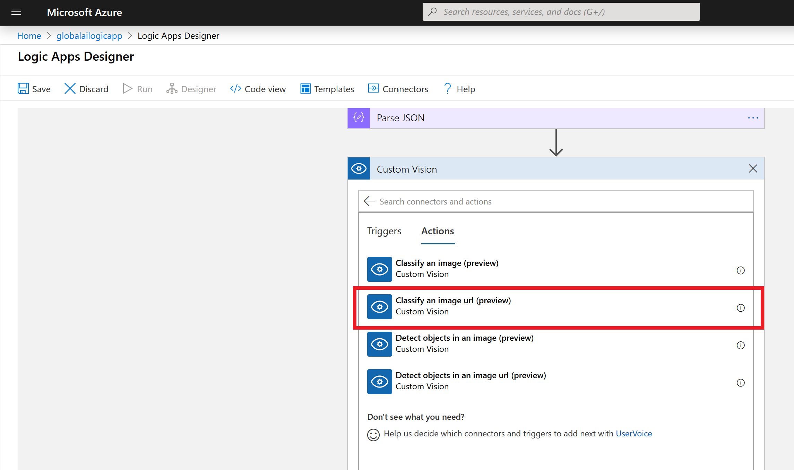

First, you have to create the Custom Vision Connection.

* **Connection Name:** Give your connection a name
* **Prediction Key:** Use the prediction key from your model (you can find this information under your model settings of the Custom Vision webpage) NOTE: make sure you use the right key
* **URL:** Endpoint of the prediction service

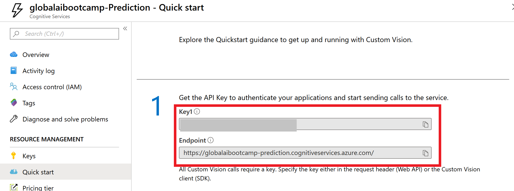

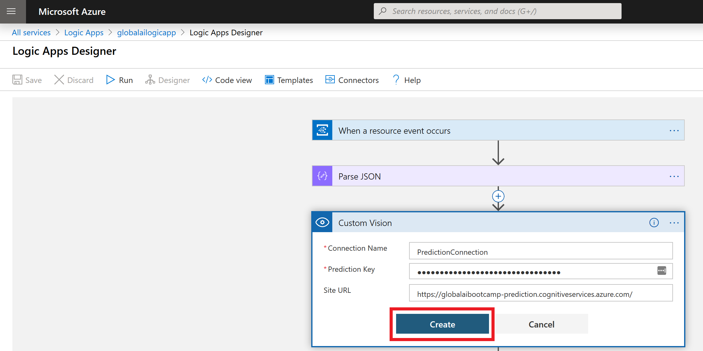

Now you need to fill in the details of the Custom Vision process:

* **Project ID:** Find the project ID from the settings logo in the top right of the Custom Vision webpage
* **Published Name:** You can find the published name from the performance tab in the Custom Vision service, under "Published as"
* **Image URL:** select the input box and on the right side select URL from Parse JSON outputs


Click on +New step.

Type **For each** and select the grey control step called "For each". Once selected in the output from previous step box, select the box and from Dynamic content select **Predictions** from the Parse JSON step.


Choose **Add an action**. Search Control, select the control icon and then from the results, select **Condition**

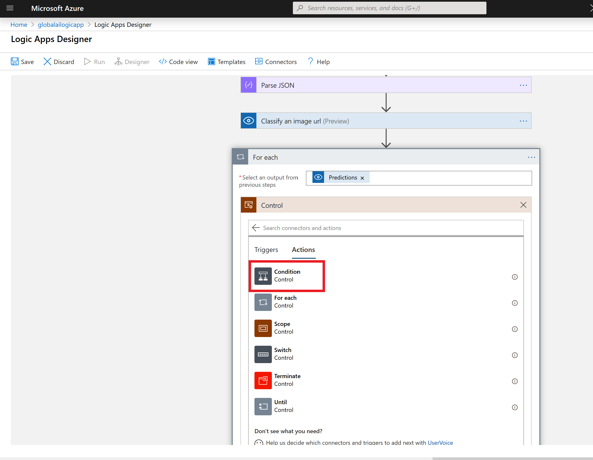

In the Condition box, select choose a value. From Dynamic content find 'Classify an image url' and then **Prediction Probability**

Set the condition to be **Prediction Probability** greater than 0.7 (as shown below), as we only want to save results with a probability of 0.7 or higher.

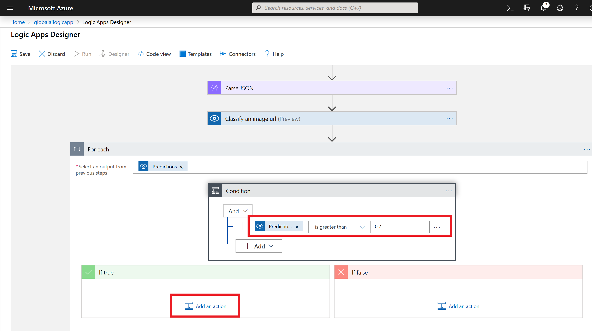

In the **If True** box select **Add an action**.

Now you want to store that value into your prior created blob storage. Therefore, search for Azure Blob Storage and select the icon for Create Blob. In connection name enter **results** and select your results blob storage account name from the listed options and select Create.

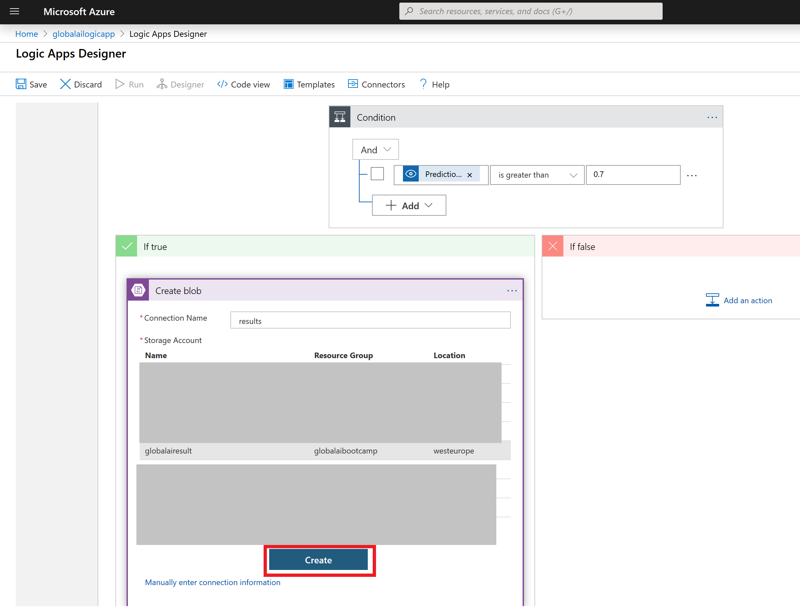

In folder path, select the folder icon, far right, and choose the container name you created that is populated.

Select the Blob name field and enter: result-(then from the Dynamic content box select **id** under Classify an image url)

Under Blob Content, select the field and in the Dynamic Content box on the right, select **see more** under Classify an image url. Then select **tagName**, enter a colon ":" and then select **probability**

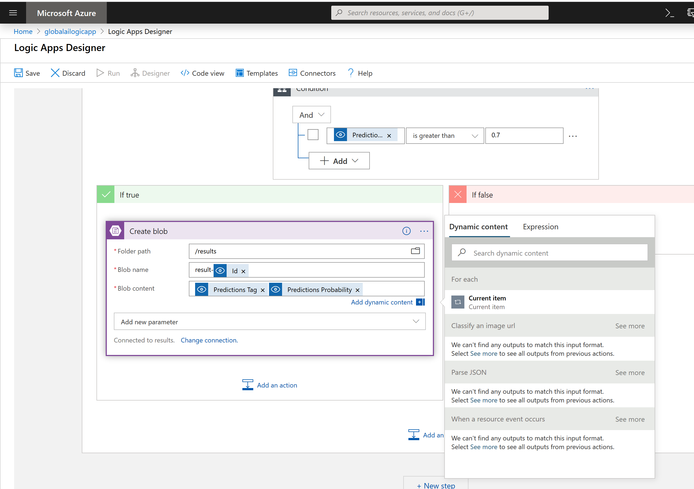

Finally you are ready to save the Logic App in the top action bar. Once saved, let's test the app for the desired outcome. Select **Run** from the top action bar.

### Test your Logic App

Now navigate to your images storage account (easy to find from the resource group section).
Choose Containers and select the images container. In there you should see an upload button. Upload one of the images from the tools data testset folder.


Once uploaded, navigate back to your Logic App main page and review the runs history section at the bottom of the page. Select the successful run and review the inputs and outputs.


All sections should have a green tick and you can select each one to view the input and output between the layers (this is also a great way to debug if it doesn't run as expected).


Finally navigate to your results blob storage account, select blob, enter the results container and review the file now created there. The contents of the file should show similar to the below - given the dog image input, the predicted class of the tool and also a confidence score:


## Clean up resources

Finally, If you don't expect to need these resources in the future, you can delete them by deleting the resource group. To do so, select the resource group for this workshop, select Delete, then confirm the name of the resource group to delete.