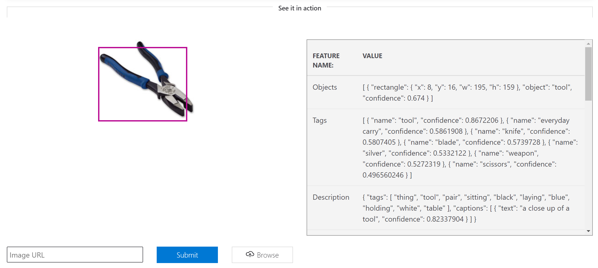

## Lab 1: Microsoft Azure Cognitive Services - Computer Vision

Microsoft Azure Cognitive Services contain some pre-built models for the most typical tasks, such as object detection in pictures, speech recognition and synthesis, sentiment analysis and so on. Let us test the **[Computer Vision API](https://azure.microsoft.com/services/cognitive-services/computer-vision/?WT.mc_id=gaic-github-cxa)** service to see if it can recognize some specific objects in one particular problem domain: construction. 

Suppose we need to create an application that recognizes 5 types of tools:

* Drills
* Hammers
* Hard hats
* Pliers
* Screwdrivers

We will use tool images sourced from [WikiMedia Commons](https://github.com/microsoft/ignite-learning-paths-training-aiml/blob/master/aiml20/CV%20training%20images/ATTRIBUTIONS.md), used for the Ignite Tours.

In this repository, we have provided two sets of images for each of the 5 classes above:
 * [training files](../CV%20training%20images/) that we will use for training our own custom model later
 * [test images](../CV%20test%20images), which we will use to evaluate the model

Let us start by looking at how pre-trained [Computer Vision cognitive service](https://azure.microsoft.com/services/cognitive-services/computer-vision/?WT.mc_id=gaic-github-cxa) can see our images:

 * Go to the home page of [Computer Vision Service](https://azure.microsoft.com/services/cognitive-services/computer-vision/?WT.mc_id=gaic-github-cxa)
 * Scroll down to **See it in action** section
 * Upload one of the gear pictures from our dataset by clicking **Browse** button, or provide URL of the picture directly from GitHub
 * Observe how the image has been classified:

While some of the objects (such as helmets or drills) can be recognized by the pre-trained model, more specialized objects (like pliers, or even hammers) are not determined correctly.

[Continue with lab 2](lab-2.md)