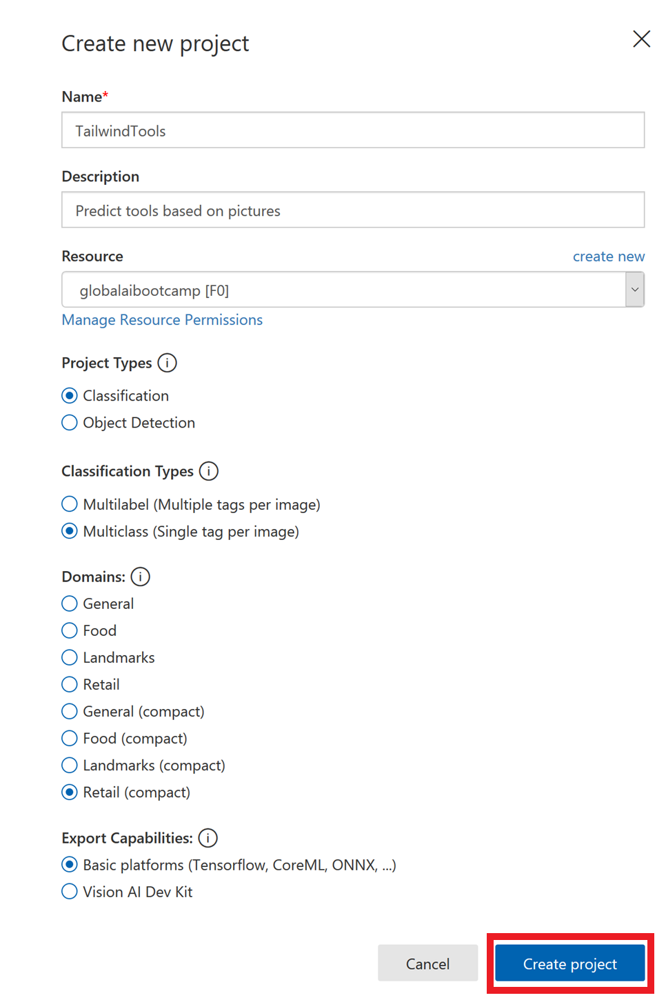
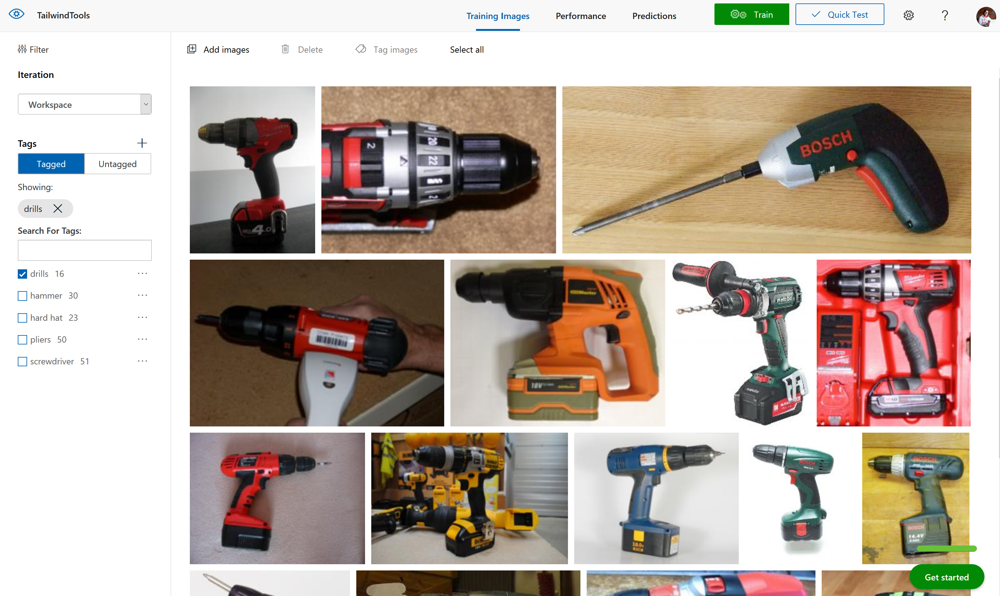
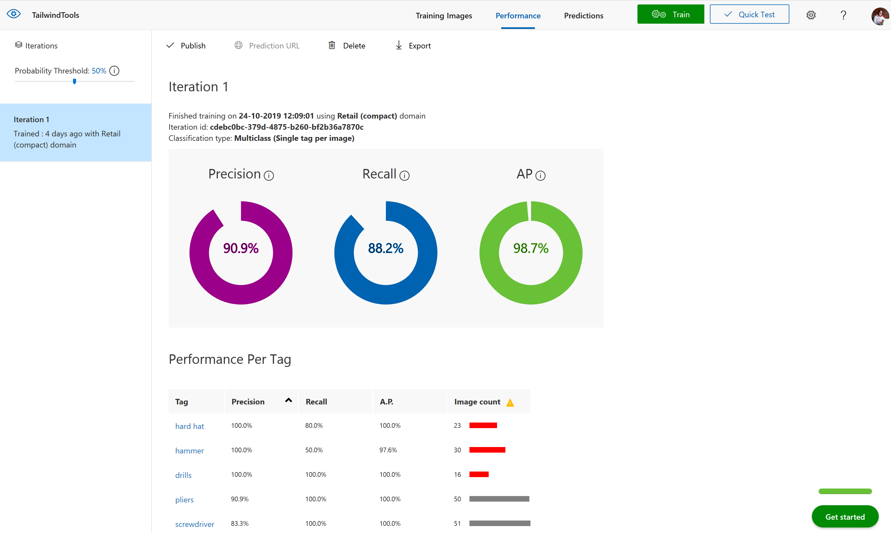
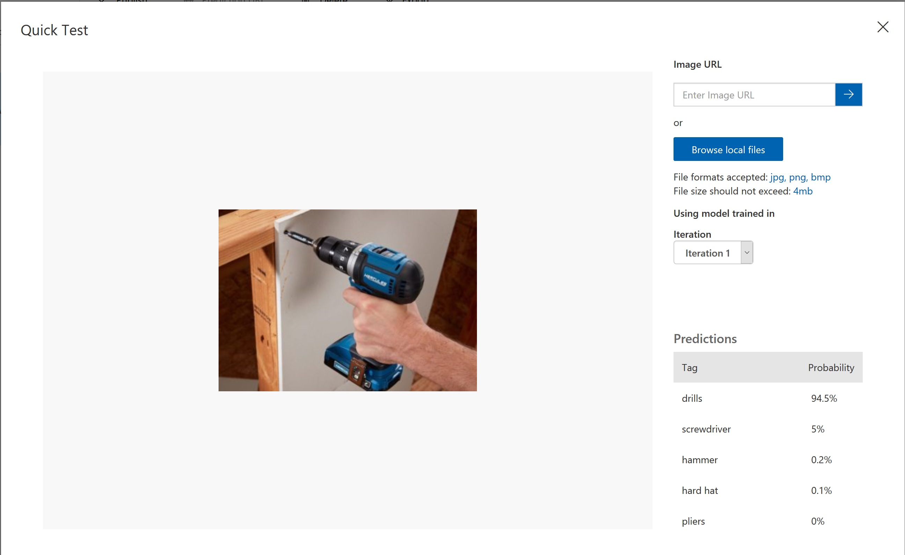
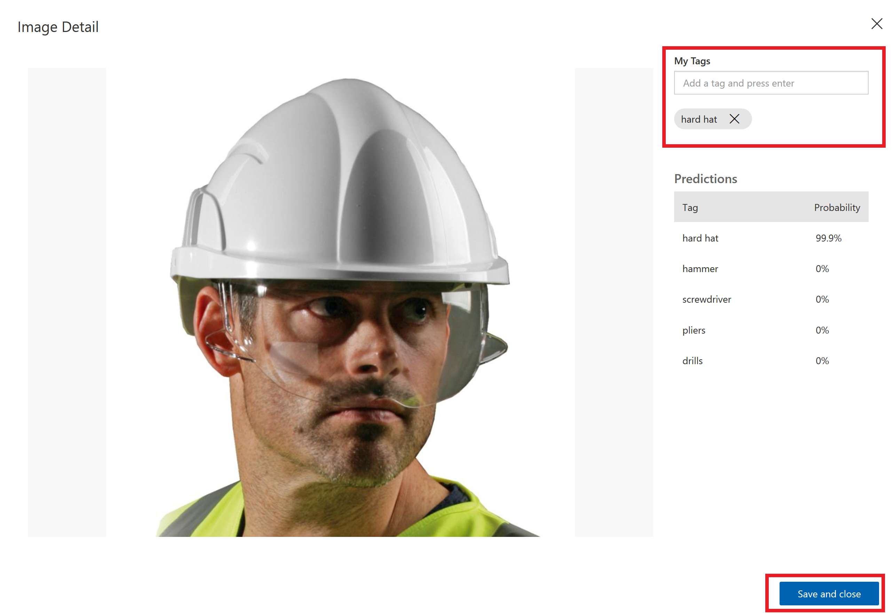
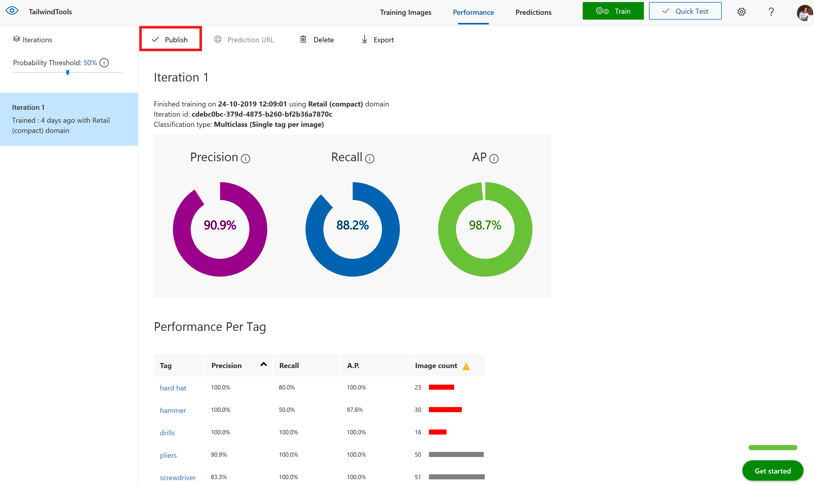
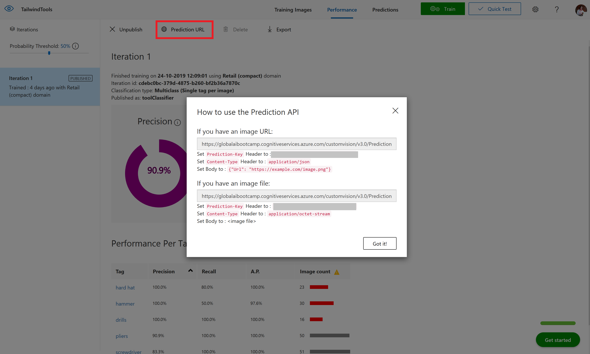
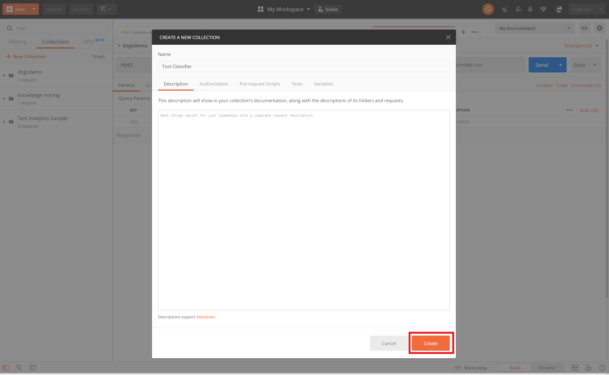
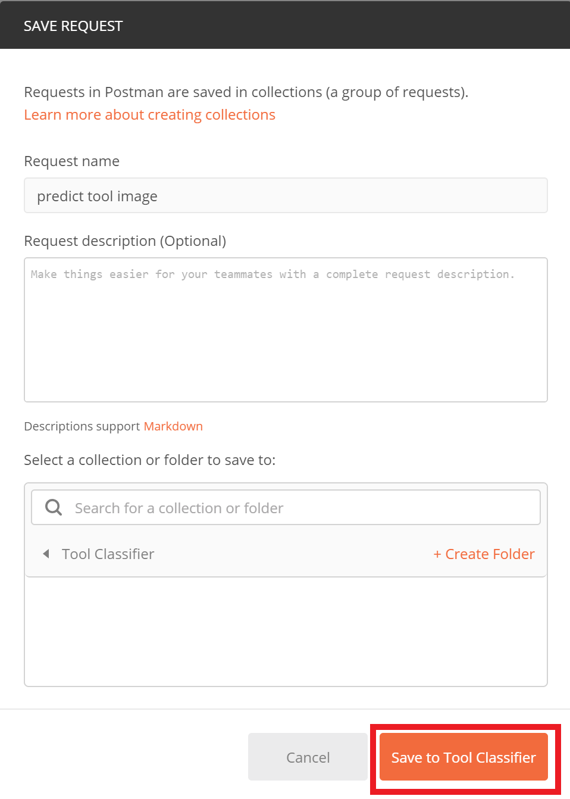
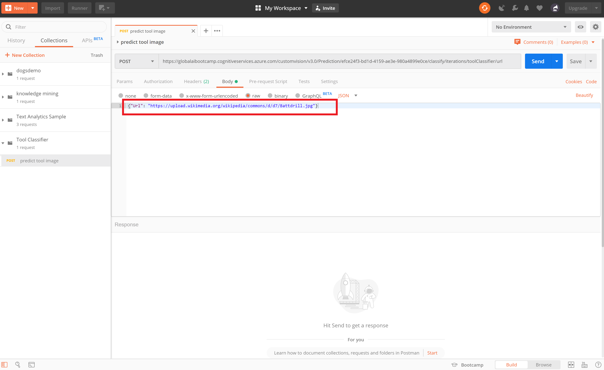

# Lab 2: Microsoft Azure Cognitive Services - Custom Vision

Using Microsoft Azure Custom Vision service you can start to build your own personalised image classification and object detection algorithms with very little code. In this exercise we will create a tool classification algorithm using 

### Create Resource Group

First create a Resource Group.

* Go to the [Azure Portal](https://ms.portal.azure.com/?WT.mc_id=gaic-github-cxa) main dashboard.
* Click 'Create a Resource' in the top left
* Search for 'Resource group'
* Enter details to create:
  * A name for the resource group
  * Select the location
  * Click Create

  

### Create Custom Vision instance

Now create a Custom Vision instance in your Azure account.

* Go to your created Resource group
* Click +Add
* Search for Custom Vision
* Click Create
* Enter details to create:
  * A name for the service
  * Select your subscription
  * Select the data centre location (in this example West Europe, but you can select your own region)
  * Choose the S0 tier for both 'Prediction pricing tier' and Training pricing tier. F0 is possible, but gives you an error with the logic app part.
  * Select your created Resource group and make sure it is in the same data centre location (in this case 'globalaibootcamp' in West Europe
  * Click Create

### Build Classifier

Now we can build our classifier, navigate to [https://www.customvision.ai](https://www.customvision.ai/?WT.mc_id=gaic-github-cxa) and choose sign in. Sign in with your Azure credentials account.

> Accept the terms and conditions box to continue.

#### Create Project

Once loaded choose 'New Project' which opens a window to enter details:

* Name: choose a suitable name
* Description: add a description of the classifier (example shown in image below)
* Resource Group: choose the resource group you created your custom vision service in (example: workshop[SO])
* Project Types: Classification
* Classification Types: Multiclass (Single tag per image)
* Domains: Retail (compact)
* Export Capabilities: Basic platforms

Click on 'Create Project' and you will land on an empty workspace.

#### Add Images

Now you can start adding images and assigning them tags to create our image classifier.

* In the top left, select 'Add images', browse for the first folder of images from the [training data](../CV%20training%20images/) - Drills - and select all the images in the folder.

* Add the tag 'drills' to the drills images and select 'Upload files'

Once successful, you receive a confirmation message and you should see that your images are now available in the workspace.

Now complete the same steps of uploading and tagging images for the other 4 tool categories in the folder. For each type of tool:

* Click 'Add images'
* Select all the tool images
* Add the class label (hard hat, pliers, etc.)
* Choose upload
* Confirm images uploaded into the workspace

Now you should have all categories uploaded and on the left hand side you can see your tool classes and you can filter depending on type of tool image.

#### Train Model

Now you are ready to train your algorithm on the tool image data you have uploaded. Select the green **'Train'** button in the top right corner. For this demo, you can use the "Fast Training" option.

Once the training process is complete it will take you to the Performance tab. Here you will receive machine learning evaluation metrics for your model. Here you algo get information regarding the class imbalance, as some tools had less images than others.

#### Test Model

Now you have a model, you need to test the model. Choose the 'Quick Test' button in the top right *(next to the train button)* this will open a window where you can browse for a local image or enter a web URL.

Browse for an image in the [test folder](CV%20test%20images) (images the model have not been trained on) and upload this image. The image will be analysed and a result returned of what tool the model thinks it is (prediction tag) and the models confidence of its result (prediction probability).

> Repeat this process for other image in the test folder, or search online for other images to see how the model performs.

#### Retrain Model

If you click on the **'Predictions'** tab on the top toolbar - you should see all the test images you have submitted. This section is for re-training, as you get new data you can add this to your model to improve its performance. The images are ordered by importance - the image, which if classified correctly, will add the most new information to the model is listed first. Whereas the last image might be very similar to other images already learnt by the model so this is less important to classify correctly.

To add these images to the model - select the first image, review the results the model provided and then in the 'My Tags' box enter the correct tag and click 'save and close'.

This image will disappear from the your predictions workspace and be added to the training images workspace. Once you add a few new images and tags you can re-train the model to see if there are improvements.

#### Publish Model

To use this model within applications you need the prediction details. Therefore, you have to go to the Performance tab from the top bar, click the **Publish** button.

Please provide a name for your model and select the Prediction resource, and click on Publish. Please take notice of you Publication Resource, which you need in the second task.

You can now select the **Prediction URL** button to gain all information you need to create a Postman call to your API.

### Use Model with Postman

Open Postman and create a new collection.

Now create a new request.

You can use the prior info to set the URL, the Header and the Body (using both an image or an image URL):

* Type of request: select POST
* URL: enter the Prediction URL
* Headers: set "Prediction-Key" and "Content-Type" items, in this case we use a URL for the image, so we set Content-Type to JSON
* Body: in this case we enter the image URL "<https://upload.wikimedia.org/wikipedia/commons/d/d7/Battdrill.jpg>"

Now click on Send...
What kind of tool did you upload?

**Great work!** you have created your specialised tool classification model using the Azure Custom Vision Service

[Continue with lab 3](lab-3.md)
