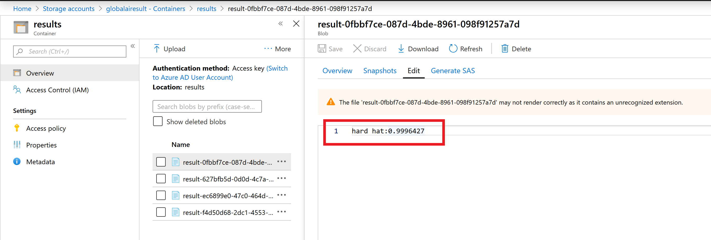

# Lab 3 : Build Custom AI into an Application - Azure Logic Apps

In this section you will build an Azure Logic App to consume your Custom Vision AI tool classification application.

First you need to create two Azure Storage Accounts.

### Create Storage accounts

Go to the prior created Resource group on the Azure portal and click "Add" to create a new resource in the top left corner. Select the section Storage and choose the first option Storage Account.

We are going to create two storage accounts:

* one for the images to be dropped into to be processed (called globalaistor)
* another for the results after processing to be uploaded to (called globalairesult)

> Complete the process below **twice** so you have two storage accounts in total

On the storage account creation page enter options to setup your storage accounts:

* **Subscription:** choose your subscription
* **Resource Group:** choose the resource group you have been using for this workshop (e.g. globalaibootcamp)
* **Storage Account Name:** (must be unique) enter an all lowercase storage account name. *Such as globalaistor(yourname) or globalairesult(yourname) - append your name to the end of the storage account name so you know its unique (remove the brackets)*
* **Location:** your closest data center (in this case West Europe)
* **Performance:** Standard
* **Account Kind:** Blob Storage
* **Replication:** Locally-redundant storage (LRS)
* **Access Tier:** Hot

Select **Review + create**, confirm validation is passed and then select **Create**

Once your deployment is complete, got to the resource and review the account settings.
Select **Containers** to review your empty blob storage account.

We need to add a container to the storage account to store our images and results.

Select the **+ Container** button and create a name for the container
> an example for the **globalaistor** account would be **images**
> an example for the **globalairesult** account would be **results**

For the public access level setting select **Container (anonymous read access for containers and blobs)**

> Complete the above for an image storage account and a results storage account with the same settings

### Create Logic App

Now we will create a Logic App - this will connect your image storage account to your AI classification service and put the results in your results storage account

Head to the Azure Portal Homepage. You are going to use Event Grid, a service that detects triggers in an Azure subscription (in our case, when a new blob is created in your Azure Storage account). Before you build with this - you must register it.

Navigate to Subscriptions, select your subscription and find Resource Providers in the left pane. If it's not in left panel, select "All services" and find in here. Once the resource providers are listed - search "event" and select **Microsoft.EventGrid**.

If this is not already status registered, select **register** from the toolbar.

Once registered with a green tick - go back to your Resource Group. Select **Add**. Type Logic App and select the service.

Create the logic app by entering some setup detail like below:

* **Name:** suitable name for the tool classification application
* **Subscription:** Choose your subscription
* **Resource Group:** (use existing e.g. globalaibootcamp) select the resource group you have been working for the whole workshop
* **Location:** choose the data center closest to you
* **Log Analytics:** off

Choose **Create**

Once created, go to resource. From here we can create our logic process. Select **Logic app designer** from the left menu and then the  **When an Event Grid resource event occurs** option.

Connect to Azure event grid by signing in using your Azure credentials.

Once connected and you see a green tick, select continue.

Select the options below:

* **Subscription:** your subscription
* **Resource Type:** Microsoft.Storage.StorageAccounts
* **Resource Name:** choose your image storage account (e.g. globalaistor)
* **Event Type Item - 1:** Microsoft.Storage.BlobCreated

Then choose +New step. Type **Parse JSON** and select the parse JSON operator as part of the data Data Operations category.

* **Content:** select the box and from the Dynamic Content box on the right, select **Body**
* **Schema:** select this box and enter the JSON schema provided in the [logic-app-schema file](logic-app-schema.json), created by [Amy Boyd](https://github.com/amynic/AINights/blob/master/sample-code/logic-app-task/logic-app-schema1.json).

Then choose next step. Type **Custom Vision** and select the **Classify an image URL (preview)** as below.

First, you have to create the Custom Vision Connection.

* **Connection Name:** Give your connection a name
* **Prediction Key:** Use the prediction key from your model (you can find this information under your model settings of the Custom Vision webpage) NOTE: make sure you use the right key
* **URL:** Endpoint of the prediction service

Now you need to fill in the details of the Custom Vision process:

* **Project ID:** Find the project ID from the settings logo in the top right of the Custom Vision webpage
* **Published Name:** You can find the published name from the performance tab in the Custom Vision service, under "Published as"
* **Image URL:** select the input box and on the right side select URL from Parse JSON outputs

Click on +New step.

Type **For each** and select the grey control step called "For each". Once selected in the output from previous step box, select the box and from Dynamic content select **Predictions** from the Parse JSON step.

Choose **Add an action**. Search Control, select the control icon and then from the results, select **Condition**

In the Condition box, select choose a value. From Dynamic content find 'Classify an image url' and then **Prediction Probability**

Set the condition to be **Prediction Probability** greater than 0.7 (as shown below), as we only want to save results with a probability of 0.7 or higher.

In the **If True** box select **Add an action**.

Now you want to store that value into your prior created blob storage. Therefore, search for Azure Blob Storage and select the icon for Create Blob. In connection name enter **results** and select your results blob storage account name from the listed options and select Create.

In folder path, select the folder icon, far right, and choose the container name you created that is populated.

Select the Blob name field and enter: result-(then from the Dynamic content box select **id** under Classify an image url)

Under Blob Content, select the field and in the Dynamic Content box on the right, select **see more** under Classify an image url. Then select **tagName**, enter a colon ":" and then select **probability**

Finally you are ready to save the Logic App in the top action bar. Once saved, let's test the app for the desired outcome. Select **Run** from the top action bar.

### Test your Logic App

Now navigate to your images storage account (easy to find from the resource group section).
Choose Containers and select the images container. In there you should see an upload button. Upload one of the images from the tools data testset folder.

Once uploaded, navigate back to your Logic App main page and review the runs history section at the bottom of the page. Select the successful run and review the inputs and outputs.

All sections should have a green tick and you can select each one to view the input and output between the layers (this is also a great way to debug if it doesn't run as expected).

Finally navigate to your results blob storage account, select blob, enter the results container and review the file now created there. The contents of the file should show similar to the below - given the dog image input, the predicted class of the tool and also a confidence score:

